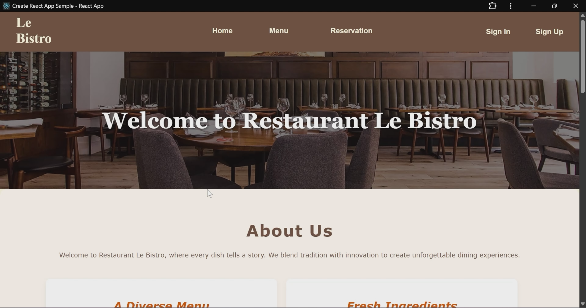

## 🍽️ restaurant-reservation-platform

A full-stack restaurant reservation web platform built with **JavaScript**, **React**, **Node.js**, and **MySQL**. This app allows users to easily make reservations through a responsive UI, while the backend handles booking logic, data persistence, and API routing.

---

## 🚀 Features

- 📱 **Responsive React Frontend** – clean and modern interface for users to book reservations
- 🔧 **Node.js + Express Backend** – RESTful API for managing reservations and users
- 🛢️ **MySQL Database** – stores client and reservation data with relational integrity
- ✅ **Transaction-Safe Logic** – ensures valid and consistent reservation entries
- 👨‍💻 **Easy to Set Up Locally** – developer-friendly installation and configuration

---

## 🖼️ Demo

<!-- Uncomment below and add a screenshot of the live app -->
 

---

## 🛠️ Tech Stack

- **Frontend**: JavaScript, React, Axios, HTML5, CSS3
- **Backend**: JavaScript (Node.js, Express)
- **Database**: MySQL

---

## 📦 Getting Started

Follow these steps to set up the project locally.

### ✅ Prerequisites

- [Node.js](https://nodejs.org/) (v14+)
- npm (Node Package Manager)
- [MySQL Server](https://www.mysql.com/)

---

### ⚙️ Installation

1. **Clone the repository**

```bash
git clone https://github.com/yourusername/resto-reservation-app.git
cd resto-reservation-app
````

2. **Install dependencies**

```bash
# Frontend setup
cd client
npm install

# Backend setup
cd ../server
npm install
```

3. **Set up the MySQL database**

* Open your MySQL client (e.g. MySQL Workbench, phpMyAdmin, CLI)
* Create a database:

```sql
CREATE DATABASE db_resto;
```

* Update the DB credentials in `server/server.js`:

```js
const connection = mysql.createConnection({
  host: 'localhost',
  user: 'your_mysql_user',
  password: 'your_mysql_password',
  database: 'db_resto'
});
```

---

### ▶️ Running the App

1. **Start the backend**

```bash
cd server
node server.js
```

2. **Start the frontend**

```bash
cd ../client
npm start
```

3. **Visit in your browser**

* Frontend: [http://localhost:3000](http://localhost:3000)
* Backend API: [http://localhost:5000](http://localhost:5000)

---

## 🗂️ Project Structure

```
resto-reservation-app/
├── client/         # React frontend
│   ├── public/
│   └── src/
├── server/         # Node.js + Express backend
│   └── server.js
├── README.md
└── package.json     # Root-level config (optional if managing both)
```
